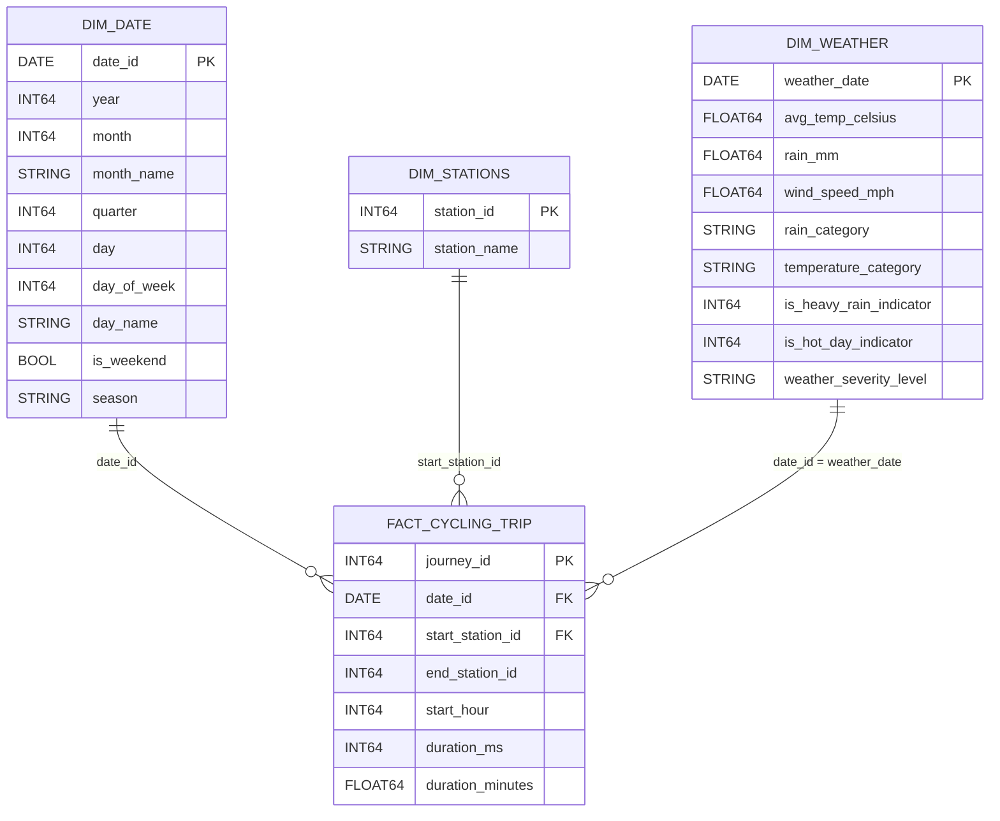

# Entity Relationship Diagram (ERD)

```mermaid
erDiagram
  FACT_CYCLING_TRIP {
    INT64  journey_id PK
    DATE    date_id FK
    INT64   start_station_id FK
    INT64   end_station_id
    INT64   start_hour
    INT64   duration_ms
    FLOAT64 duration_minutes
  }

  DIM_DATE {
    DATE    date_id PK
    INT64   year
    INT64   month
    STRING  month_name
    INT64   quarter
    INT64   day
    INT64   day_of_week
    STRING  day_name
    BOOL    is_weekend
    STRING  season
  }

  DIM_WEATHER {
    DATE    weather_date PK
    FLOAT64 avg_temp_celsius
    FLOAT64 rain_mm
    FLOAT64 wind_speed_mph
    STRING  rain_category
    STRING  temperature_category
    INT64   is_heavy_rain_indicator
    INT64   is_hot_day_indicator
    STRING  weather_severity_level
  }

  DIM_STATIONS {
    INT64   station_id PK
    STRING  station_name
  }

  DIM_DATE     ||--o{ FACT_CYCLING_TRIP : "date_id"
  DIM_STATIONS ||--o{ FACT_CYCLING_TRIP : "start_station_id"
  DIM_WEATHER  ||--o{ FACT_CYCLING_TRIP : "date_id = weather_date"
```
